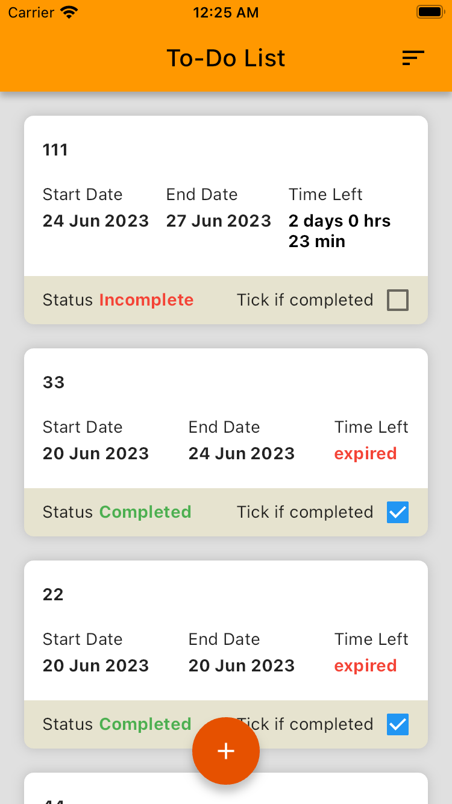
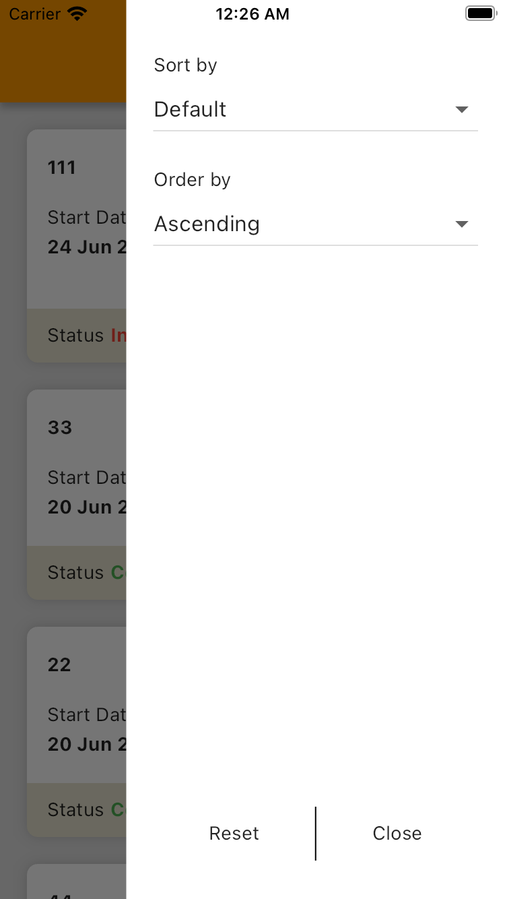
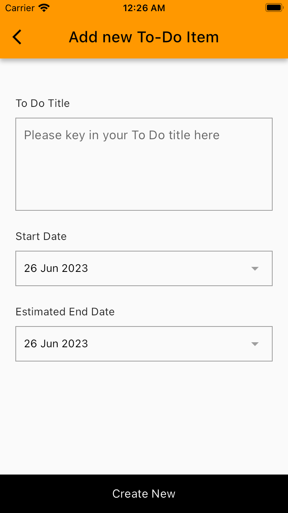

# etiqa-demo

how to build and run using Android Studio
1. Clone using Android Studio
2. connect iPhone or Android phone
3. flutter run > to run app
4. flutter test > to run unit and widget tests

Bonus
1. ✅ Continuous Integration using GitHub workflows
2. ✅ Unit Test 

Create an application following the above screen design.
1. ✅ User can add or edit one of the TODO item.
2. ✅ When user taps add button , navigate to page 2.
3. ✅ When user fills up and saved, app navigate back to the page 1 listing.
4. ✅ When user taps an item, navigate to page 2 with its detail.
5. ✅ User can save the changes, see the changes on page 1 listing.

Deployed to both GitHub and Heroku
1. Github https://lovaicv.github.io/
2. Heroku https://etiqa-demo-93a39e04f200.herokuapp.com/

